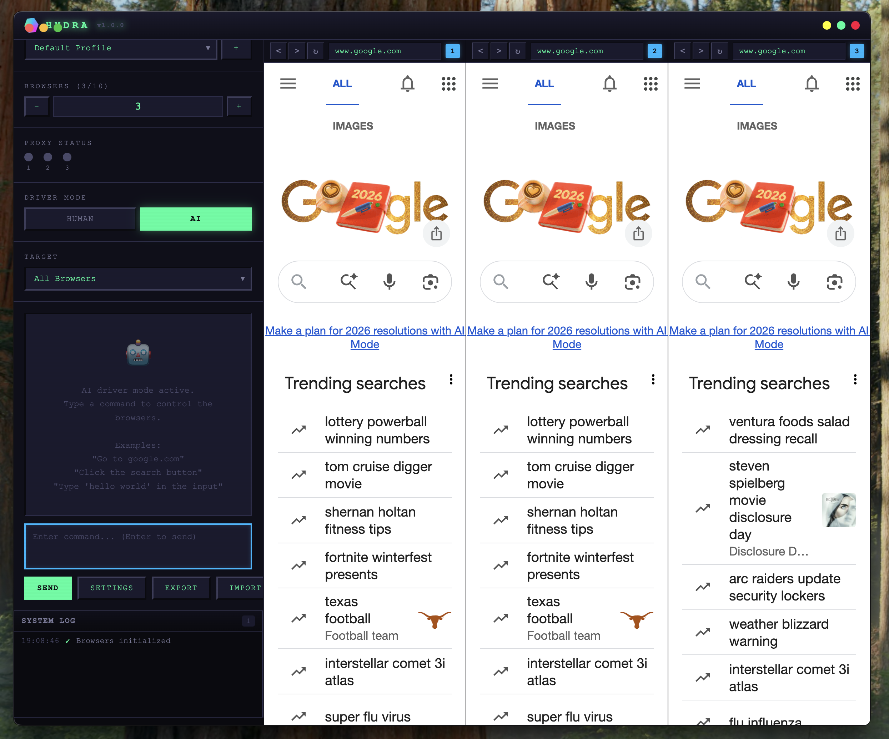

# HYDRA

**Multi-Session Browser Orchestrator with AI Automation**

Run multiple isolated browser sessions simultaneously, control them with AI, and appear as real mobile devices to websites.



## What is HYDRA?

HYDRA is a desktop application that lets you run multiple browser sessions side-by-side, each with its own isolated identity. Whether you're managing multiple accounts, testing web applications, or automating repetitive browser tasks, HYDRA gives you the tools to do it efficiently.

**Key capabilities:**

- **Multiple Isolated Sessions** — Each browser runs in its own sandbox with separate cookies, localStorage, and fingerprint
- **AI-Powered Automation** — Tell Claude what you want to do in plain English and watch it happen across all browsers
- **Mobile Device Emulation** — Each browser appears as an iPhone 12 Pro to websites, complete with spoofed fingerprints
- **Persistent Profiles** — Save and restore complete session states including cookies, storage, and browser fingerprints

## Features

### Multi-Browser Management
Run 1-10 browser instances simultaneously. Each browser is completely isolated with its own:
- Session storage and cookies
- Unique browser fingerprint
- Optional proxy configuration

### AI Automation
Built-in Claude AI assistant that can:
- Navigate to websites
- Click buttons and links
- Fill out forms
- Scroll pages
- Extract information
- Execute multi-step workflows

Just describe what you want in natural language.

### Fingerprint Spoofing
Comprehensive fingerprint randomization to avoid detection:
- Canvas fingerprint noise
- WebGL renderer/vendor spoofing
- Audio context fingerprinting protection
- Navigator properties (userAgent, platform, languages)
- Chrome object consistency fixes
- Screen dimensions (iPhone 12 Pro: 390×844)
- Timezone spoofing
- WebRTC IP leak prevention

### Session Persistence
Save complete browser states as profiles:
- Cookies
- Local storage
- Fingerprint configuration
- Proxy settings

## Use Cases

- **QA Testing** — Test user flows across multiple sessions simultaneously
- **Account Management** — Manage multiple accounts with isolated sessions
- **Web Scraping** — Rotate identities and proxies for data collection
- **Development** — Test responsive designs and cross-session behavior

## Getting Started

### Prerequisites

- Node.js 18 or higher
- npm
- An [Anthropic API key](https://console.anthropic.com/) (for AI features)

### Installation

```bash
# Clone the repository
git clone https://github.com/nicholashopper/hydra.git
cd hydra

# Install dependencies
npm install

# Set up environment
cp .env.example .env
```

Edit `.env` and add your Anthropic API key:
```
ANTHROPIC_API_KEY=your-api-key-here
```

### Running

```bash
# Development mode (with hot reload)
npm run dev

# Build for production
npm run build

# Run production build
npm start
```

## Usage

### Creating a Profile
1. Click the **+** button next to the profile dropdown
2. Enter a name for your profile
3. The profile will save your session state automatically

### Managing Browsers
- Use the **+** and **−** buttons to add or remove browser instances (1-10)
- Each browser appears as a separate column with its own navigation bar

### AI Commands
1. Make sure **Driver Mode** is set to **AI**
2. Type your command in the prompt input (e.g., "Go to twitter.com and search for 'AI news'")
3. Click **Send** or press Enter
4. Watch as Claude executes your command across all targeted browsers

### Manual Control
Set **Driver Mode** to **Manual** to control browsers directly. Your inputs will be broadcast to all targeted browsers with human-like variance.

### Targeting
Use the **Target** dropdown to control which browsers receive commands:
- **All Browsers** — Commands go to every browser
- **Browser 1/2/3...** — Commands go to a specific browser only

## Tech Stack

- **Electron** — Cross-platform desktop framework
- **React + TypeScript** — UI components
- **Claude AI** — Natural language automation (Anthropic)
- **SQLite** — Profile and session storage
- **Vite** — Build tooling

## License

MIT
